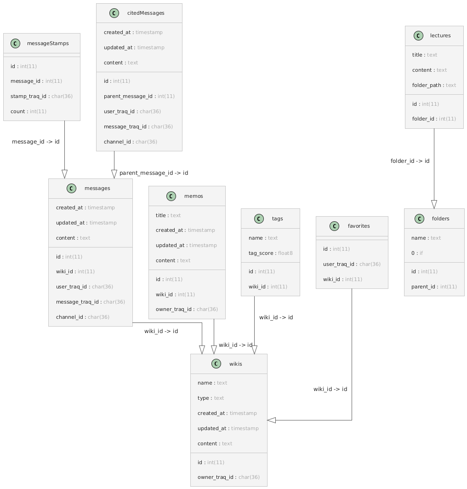

# Database Schema

## TOC
- [wikis](#wikis)
- [messages](#messages)
- [messageStamps](#messagestamps)
- [citedMessages](#citedmessages)
- [memos](#memos)
- [tags](#tags)
- [folders](#folders)
- [lectures](#lectures)
- [favorites](#favorites)
## Tables

### wikis

| Column Name | Data Type | Constraints |
|-------------|-----------|-------------|
| id | int(11) | not null primary key auto_increment |
| name | text | not null |
| type | text | not null |
| created_at | timestamp | not null default current_timestamp |
| updated_at | timestamp | not null default current_timestamp |
| owner_traq_id | char(36) | not null |
| content | text | not null |

### messages

| Column Name | Data Type | Constraints |
|-------------|-----------|-------------|
| id | int(11) | not null primary key auto_increment |
| wiki_id | int(11) | not null |
| created_at | timestamp | not null default current_timestamp |
| updated_at | timestamp | not null default current_timestamp |
| user_traq_id | char(36) | not null |
| message_traq_id | char(36) | not null |
| channel_id | char(36) | not null |
| content | text | not null |

##### Foreign Keys
| Key Name | Reference |
|----------|-----------|
| (wiki_id) | wikis(id) |
### messageStamps

| Column Name | Data Type | Constraints |
|-------------|-----------|-------------|
| id | int(11) | not null primary key auto_increment |
| message_id | int(11) | not null |
| stamp_traq_id | char(36) | not null |
| count | int(11) | not null |

##### Foreign Keys
| Key Name | Reference |
|----------|-----------|
| (message_id) | messages(id) |
### citedMessages

| Column Name | Data Type | Constraints |
|-------------|-----------|-------------|
| id | int(11) | not null primary key auto_increment |
| parent_message_id | int(11) | not null |
| created_at | timestamp | not null default current_timestamp |
| updated_at | timestamp | not null default current_timestamp |
| user_traq_id | char(36) | not null |
| message_traq_id | char(36) | not null |
| channel_id | char(36) | not null |
| content | text | not null |

##### Foreign Keys
| Key Name | Reference |
|----------|-----------|
| (parent_message_id) | messages(id) |
### memos

| Column Name | Data Type | Constraints |
|-------------|-----------|-------------|
| id | int(11) | not null primary key auto_increment |
| wiki_id | int(11) | not null |
| title | text | not null |
| created_at | timestamp | not null default current_timestamp |
| updated_at | timestamp | not null default current_timestamp |
| owner_traq_id | char(36) | not null |
| content | text | not null |

##### Foreign Keys
| Key Name | Reference |
|----------|-----------|
| (wiki_id) | wikis(id) |
### tags

| Column Name | Data Type | Constraints |
|-------------|-----------|-------------|
| id | int(11) | not null primary key auto_increment |
| wiki_id | int(11) | not null |
| name | text | not null |
| tag_score | float8 | not null |

##### Foreign Keys
| Key Name | Reference |
|----------|-----------|
| (wiki_id) | wikis(id) |
### folders

| Column Name | Data Type | Constraints |
|-------------|-----------|-------------|
| id | int(11) | not null primary key auto_increment |
| name | text | not null |
| parent_id | int(11) |  |
| 0 | if | root |

### lectures

| Column Name | Data Type | Constraints |
|-------------|-----------|-------------|
| id | int(11) | not null primary key auto_increment |
| title | text | not null |
| content | text | not null |
| folder_id | int(11) |  |
| folder_path | text | not null |

##### Foreign Keys
| Key Name | Reference |
|----------|-----------|
| (folder_id) | folders(id) |
### favorites

| Column Name | Data Type | Constraints |
|-------------|-----------|-------------|
| id | int(11) | not null primary key auto_increment |
| user_traq_id | char(36) | not null |
| wiki_id | int(11) | not null |

##### Foreign Keys
| Key Name | Reference |
|----------|-----------|
| (wiki_id) | wikis(id) |

## Diagram
