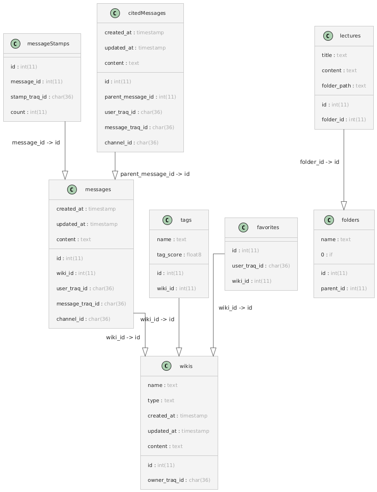

# Database Schema

## wikis
| Column Name | Data Type | Constraints |
|-------------|-----------|-------------|
| id          | INT(11)   | NOT NULL PRIMARY KEY AUTO_INCREMENT |
| name        | TEXT      | NOT NULL |
| type        | TEXT      | NOT NULL |
| created_at  | TIMESTAMP | NOT NULL DEFAULT CURRENT_TIMESTAMP |
| updated_at  | TIMESTAMP | NOT NULL DEFAULT CURRENT_TIMESTAMP |
| owner_traq_id | CHAR(36) | NOT NULL |
| content     | TEXT      | NOT NULL |

## messages
| Column Name   | Data Type | Constraints |
|---------------|-----------|-------------|
| id            | INT(11)   | NOT NULL PRIMARY KEY AUTO_INCREMENT |
| wiki_id       | INT(11)   | NOT NULL, **FOREIGN KEY REFERENCES wikis(id)** |
| created_at    | TIMESTAMP | NOT NULL DEFAULT CURRENT_TIMESTAMP |
| updated_at    | TIMESTAMP | NOT NULL DEFAULT CURRENT_TIMESTAMP |
| user_traq_id  | CHAR(36)  | NOT NULL |
| message_traq_id | CHAR(36) | NOT NULL |
| channel_id    | CHAR(36)  | NOT NULL |
| content       | TEXT      | NOT NULL |

## messageStamps
| Column Name   | Data Type | Constraints |
|---------------|-----------|-------------|
| id            | INT(11)   | NOT NULL PRIMARY KEY AUTO_INCREMENT |
| message_id    | INT(11)   | NOT NULL, **FOREIGN KEY REFERENCES messages(id)** |
| stamp_traq_id | CHAR(36)  | NOT NULL |
| count         | INT(11)   | NOT NULL |

## memos
| Column Name   | Data Type | Constraints |
|---------------|-----------|-------------|
| id            | INT(11)   | NOT NULL PRIMARY KEY AUTO_INCREMENT |
| wiki_id       | INT(11)   | NOT NULL, **FOREIGN KEY REFERENCES wikis(id)** |
| created_at    | TIMESTAMP | NOT NULL DEFAULT CURRENT_TIMESTAMP |
| updated_at    | TIMESTAMP | NOT NULL DEFAULT CURRENT_TIMESTAMP |
| owner_traq_id | CHAR(36)  | NOT NULL |
| content       | TEXT      | NOT NULL |

## tags
| Column Name | Data Type | Constraints |
|-------------|-----------|-------------|
| id          | INT(11)   | NOT NULL PRIMARY KEY AUTO_INCREMENT |
| name        | TEXT      | NOT NULL |

## tags_in_wiki
| Column Name | Data Type | Constraints |
|-------------|-----------|-------------|
| wiki_id     | INT(11)   | NOT NULL, PRIMARY KEY, **FOREIGN KEY REFERENCES wikis(id)** |
| tag_id      | INT(11)   | NOT NULL, PRIMARY KEY, **FOREIGN KEY REFERENCES tags(id)** |

## lectures
| Column Name | Data Type | Constraints |
|-------------|-----------|-------------|
| id          | INT(11)   | NOT NULL PRIMARY KEY AUTO_INCREMENT |
| title       | TEXT      | NOT NULL |
| content     | TEXT      | NOT NULL |
| folder_id   | INT(11)   |  |
| folder_path | TEXT      | NOT NULL |

## folders
| Column Name | Data Type | Constraints |
|-------------|-----------|-------------|
| id          | INT(11)   | NOT NULL PRIMARY KEY AUTO_INCREMENT |
| name        | TEXT      | NOT NULL |
| parent_id   | INT(11)   | 0 if root, UNIQUE KEY (name, parent_id) |

# Diagram
